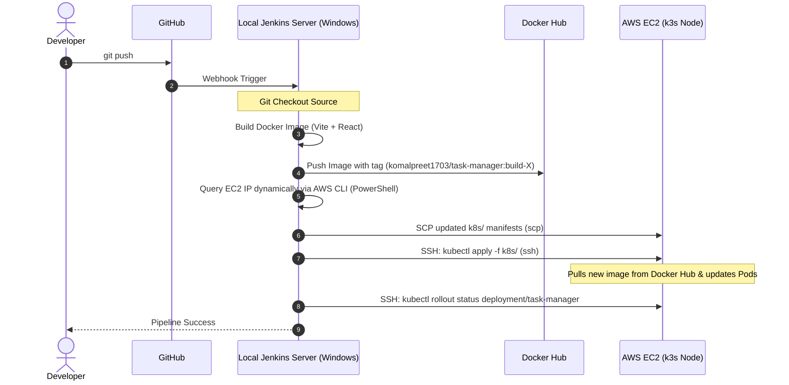

# Project Report: DevOps Task Manager
## Production-Ready Remote CI/CD Pipeline & AWS Infrastructure Management

---

## 1. Executive Summary

This report outlines the deployment architecture, configuration steps, and automated CI/CD pipeline for the **DevOps Task Manager** application. The project is designed to prioritize stability, resource efficiency, and simplicity:
- **Phase 1 — One-Time Server Setup:** Terraform provisions the AWS EC2 instance (`t3.micro` default) with Docker and k3s automatically installed via `user_data` (optimized with `--disable traefik --disable servicelb` to conserve memory).
- **Phase 2 — Automated CI/CD:** A lightweight, automated Jenkins pipeline running locally on the developer's Windows machine checks out the source code, builds the Docker image, pushes it to Docker Hub, and executes a remote deployment via SSH.
- **Monitoring Architecture:** To operate stably within AWS free-tier limit constraints (1GB RAM on `t3.micro`), we adopt a **hybrid observability model**. Prometheus and Grafana run locally on the developer's machine using Docker Compose, scraping metrics remotely from lightweight exporters (`node_exporter` and `kube-state-metrics`) running on the EC2 host.

By keeping the heavy build engine (Jenkins), query database (Prometheus), and visualization UI (Grafana) running locally, we keep the remote EC2 instance's memory footprint extremely low and guarantee high cluster stability.

---

## 2. Phase 1 — One-Time Server Setup

### 2.1 Host Specifications & Sizing Strategy
Running container orchestration and monitoring stacks on limited cloud resources requires careful memory budgeting.
- **Instance Type Selection:** `t3.micro` (2 vCPUs, 1GB RAM)
  - *Sizing Strategy:* To operate within AWS free-tier limit constraints, we deploy on a single `t3.micro` instance.
  - *Optimization Strategy:* Running heavy Docker builds and Jenkins pipeline orchestration locally saves critical CPU and memory on the target server. Furthermore, the remote k3s cluster is optimized by disabling embedded controllers, and the database metrics storage is offloaded to the local machine, preserving the EC2 instance's RAM for the core task-manager application.

### 2.2 Security Group Rules
The security group is configured to allow administration, API access, application routing, and remote metric collection:

| Port | Protocol | Purpose | Access Source |
|------|----------|---------|---------------|
| `22` | TCP | SSH — Remote administration and Jenkins pipeline deployment | Restricted to Developer/Jenkins IP |
| `80` | TCP | HTTP — Task Manager application routing | Any (0.0.0.0/0) |
| `6443` | TCP | Kubernetes API — Remote kubectl | Restricted to Admin IP |
| `9100` | TCP | Node Exporter — Host system metrics | Restricted to Admin/Prometheus IP |
| `30080` | TCP | App NodePort — Exposes Task Manager frontend | Any (0.0.0.0/0) |
| `30091` | TCP | Kube-State-Metrics NodePort — Exposed cluster state metrics | Restricted to Admin/Prometheus IP |

---

### 2.3 Auto-Installation via User Data
Terraform automatically bootstraps the instance using the `user_data` script, which installs Docker and installs an optimized k3s cluster:

```bash
curl -sfL https://get.k3s.io | sh -s - \
  --write-kubeconfig-mode 644 \
  --node-external-ip=$(curl -s http://169.254.169.254/latest/meta-data/public-ipv4) \
  --disable traefik \
  --disable servicelb
```

---

### 2.4 Remote Exporters Setup (One-Time)
SSH into the EC2 instance and set up the lightweight exporters:

#### 1. Setup Node Exporter (Host System Metrics)
```bash
wget https://github.com/prometheus/node_exporter/releases/download/v1.7.0/node_exporter-1.7.0.linux-amd64.tar.gz
tar -xvf node_exporter-1.7.0.linux-amd64.tar.gz
sudo mv node_exporter-1.7.0.linux-amd64/node_exporter /usr/local/bin/

sudo tee /etc/systemd/system/node_exporter.service <<EOF
[Unit]
Description=Node Exporter
After=network.target

[Service]
User=ubuntu
ExecStart=/usr/local/bin/node_exporter

[Install]
WantedBy=multi-user.target
EOF

sudo systemctl daemon-reload
sudo systemctl enable --now node_exporter
```

#### 2. Setup Kube-State-Metrics (Cluster State Metrics)
The manifest file (`k8s/kube-state-metrics.yaml`) is copied and applied dynamically as part of the Kubernetes directory rollout. It exposes metrics on NodePort `30091`.

---

## 3. Phase 2 — Automated CI/CD

### 3.1 Repository Structure
```text
devops-task-manager/
├── app/                  # React frontend source code (Vite + React)
├── docker/               # Dockerfile for multi-stage image build
├── k8s/                  # Kubernetes Deployment and Service manifests
│   ├── deployment.yaml
│   ├── service.yaml
│   └── kube-state-metrics.yaml
├── terraform/            # Terraform configurations
│   ├── main.tf
│   ├── variables.tf
│   ├── outputs.tf
│   └── terraform.tfvars
├── jenkins/              # Jenkinsfile pipeline definition
├── monitoring/           # Local observability configurations
│   ├── README.md
│   ├── prometheus-local.yml
│   └── docker-compose.yml
└── deploy.sh             # Helper shell script for manual remote deployments
```

### 3.2 Automated CI/CD Workflow
The local Jenkins server coordinates the delivery pipeline:



---

## 4. Implementation Artifacts

### 4.1 Dockerfile (`docker/Dockerfile`)
```dockerfile
FROM node:20-alpine as build
WORKDIR /app
COPY app/package.json app/package-lock.json* ./
RUN npm install
COPY app/ ./
RUN npm run build

FROM nginx:alpine
RUN rm -rf /usr/share/nginx/html/*
COPY --from=build /app/dist /usr/share/nginx/html
EXPOSE 80
CMD ["nginx", "-g", "daemon off;"]
```

### 4.2 Jenkinsfile (`jenkins/Jenkinsfile`)
```groovy
pipeline {
    agent any

    environment {
        DOCKER_HUB_CREDENTIALS_ID = 'dockerhub-creds'
        DOCKER_IMAGE = 'komalpreet1703/task-manager'
        IMAGE_TAG = "${env.BUILD_NUMBER}"
    }

    stages {
        stage('Checkout Source') {
            steps {
                checkout scm
            }
        }

        stage('Verify Tools') {
            steps {
                bat 'where aws'
                bat 'where ssh'
                bat 'where scp'
                bat 'docker --version'
                bat 'kubectl version --client'
            }
        }

        stage('Build Docker Image') {
            steps {
                bat "docker build -t ${DOCKER_IMAGE}:${IMAGE_TAG} -t ${DOCKER_IMAGE}:latest -f docker/Dockerfile ."
            }
        }

        stage('Push Docker Image') {
            steps {
                withCredentials([
                    usernamePassword(
                        credentialsId: DOCKER_HUB_CREDENTIALS_ID,
                        usernameVariable: 'DOCKER_USER',
                        passwordVariable: 'DOCKER_PASS'
                    )
                ]) {
                    bat "docker login -u %DOCKER_USER% -p %DOCKER_PASS%"
                    bat "docker push ${DOCKER_IMAGE}:${IMAGE_TAG}"
                    bat "docker push ${DOCKER_IMAGE}:latest"
                }
            }
        }

        stage('Deploy to Kubernetes') {
            steps {
                script {
                    def EC2_IP = powershell(
                        script: "aws ec2 describe-instances --region us-east-1 --filters 'Name=tag:Name,Values=Task-Manager-K3s-Node' 'Name=instance-state-name,Values=running' --query 'Reservations[*].Instances[*].PublicIpAddress' --output text",
                        returnStdout: true
                    ).trim()

                    echo "Deploying to EC2 IP: ${EC2_IP}"

                    withCredentials([
                        sshUserPrivateKey(
                            credentialsId: 'aws-ssh-key',
                            keyFileVariable: 'SSH_KEY'
                        )
                    ]) {
                        bat "scp -i \"${SSH_KEY}\" -o StrictHostKeyChecking=no -r k8s ubuntu@${EC2_IP}:/home/ubuntu/"
                        bat """
                        ssh -i "${SSH_KEY}" -o StrictHostKeyChecking=no ubuntu@${EC2_IP} "export KUBECONFIG=/etc/rancher/k3s/k3s.yaml && sed -i 's|image: .*|image: ${DOCKER_IMAGE}:${IMAGE_TAG}|g' /home/ubuntu/k8s/deployment.yaml && kubectl apply -f /home/ubuntu/k8s/ && kubectl rollout status deployment/task-manager"
                        """
                    }
                }
            }
        }

        stage('Verify Services') {
            steps {
                script {
                    def EC2_IP = powershell(
                        script: "aws ec2 describe-instances --region us-east-1 --filters 'Name=tag:Name,Values=Task-Manager-K3s-Node' 'Name=instance-state-name,Values=running' --query 'Reservations[*].Instances[*].PublicIpAddress' --output text",
                        returnStdout: true
                    ).trim()

                    withCredentials([
                        sshUserPrivateKey(
                            credentialsId: 'aws-ssh-key',
                            keyFileVariable: 'SSH_KEY'
                        )
                    ]) {
                        bat """
                        ssh -i "${SSH_KEY}" -o StrictHostKeyChecking=no ubuntu@${EC2_IP} "export KUBECONFIG=/etc/rancher/k3s/k3s.yaml && kubectl get svc && kubectl get nodes && kubectl get pods"
                        """
                    }
                }
            }
        }
    }

    post {
        success {
            echo 'Deployment successful!'
        }
        failure {
            echo 'Pipeline failed!'
        }
        always {
            bat 'docker image prune -f'
        }
    }
}
```

### 4.3 Deployment Manifesto (`k8s/deployment.yaml`)
```yaml
apiVersion: apps/v1
kind: Deployment
metadata:
  name: task-manager
  labels:
    app: task-manager
spec:
  replicas: 2
  selector:
    matchLabels:
      app: task-manager
  template:
    metadata:
      labels:
        app: task-manager
    spec:
      containers:
      - name: task-manager
        image: komalpreet1703/task-manager:latest 
        imagePullPolicy: Always
        ports:
        - containerPort: 80
        resources:
          requests:
            memory: "64Mi"
            cpu: "50m"
          limits:
            memory: "128Mi"
            cpu: "100m"
```

### 4.4 Service Manifesto (`k8s/service.yaml`)
```yaml
apiVersion: v1
kind: Service
metadata:
  name: task-manager-service
spec:
  type: NodePort
  selector:
    app: task-manager
  ports:
    - protocol: TCP
      port: 80
      targetPort: 80
      nodePort: 30080
```

### 4.5 Kube-State-Metrics Manifesto (`k8s/kube-state-metrics.yaml`)
```yaml
apiVersion: v1
kind: ServiceAccount
metadata:
  name: kube-state-metrics
  namespace: kube-system
---
apiVersion: rbac.authorization.k8s.io/v1
kind: ClusterRole
metadata:
  name: kube-state-metrics
rules:
- apiGroups: [""]
  resources:
  - configmaps
  - secrets
  - nodes
  - pods
  - services
  - resourcequotas
  - replicationcontrollers
  - limitranges
  - persistentvolumeclaims
  - persistentvolumes
  - namespaces
  - endpoints
  verbs: ["list", "watch"]
- apiGroups: ["apps"]
  resources:
  - statefulsets
  - daemonsets
  - deployments
  - replicasets
  verbs: ["list", "watch"]
- apiGroups: ["batch"]
  resources:
  - cronjobs
  - jobs
  verbs: ["list", "watch"]
- apiGroups: ["autoscaling"]
  resources:
  - horizontalpodautoscalers
  verbs: ["list", "watch"]
- apiGroups: ["authentication.k8s.io"]
  resources:
  - tokenreviews
  verbs: ["create"]
- apiGroups: ["authorization.k8s.io"]
  resources:
  - subjectaccessreviews
  verbs: ["create"]
- apiGroups: ["policy"]
  resources:
  - poddisruptionbudgets
  verbs: ["list", "watch"]
- apiGroups: ["certificates.k8s.io"]
  resources:
  - certificatesigningrequests
  verbs: ["list", "watch"]
- apiGroups: ["storage.k8s.io"]
  resources:
  - storageclasses
  - volumeattachments
  verbs: ["list", "watch"]
- apiGroups: ["admissionregistration.k8s.io"]
  resources:
  - mutatingwebhookconfigurations
  - validatingwebhookconfigurations
  verbs: ["list", "watch"]
- apiGroups: ["networking.k8s.io"]
  resources:
  - networkpolicies
  - ingresses
  verbs: ["list", "watch"]
- apiGroups: ["coordination.k8s.io"]
  resources:
  - leases
  verbs: ["list", "watch"]
---
apiVersion: rbac.authorization.k8s.io/v1
kind: ClusterRoleBinding
metadata:
  name: kube-state-metrics
roleRef:
  apiGroup: rbac.authorization.k8s.io
  kind: ClusterRole
  name: kube-state-metrics
subjects:
- kind: ServiceAccount
  name: kube-state-metrics
  namespace: kube-system
---
apiVersion: apps/v1
kind: Deployment
metadata:
  name: kube-state-metrics
  namespace: kube-system
  labels:
    app: kube-state-metrics
spec:
  replicas: 1
  selector:
    matchLabels:
      app: kube-state-metrics
  template:
    metadata:
      labels:
        app: kube-state-metrics
    spec:
      serviceAccountName: kube-state-metrics
      containers:
      - name: kube-state-metrics
        image: registry.k8s.io/kube-state-metrics/kube-state-metrics:v2.10.0
        ports:
        - containerPort: 8080
          name: http-metrics
        - containerPort: 8081
          name: telemetry
        resources:
          requests:
            cpu: "10m"
            memory: "40Mi"
          limits:
            cpu: "50m"
            memory: "100Mi"
---
apiVersion: v1
kind: Service
metadata:
  name: kube-state-metrics
  namespace: kube-system
  labels:
    app: kube-state-metrics
spec:
  type: NodePort
  ports:
  - name: http-metrics
    port: 8080
    targetPort: 8080
    nodePort: 30091
  selector:
    app: kube-state-metrics
```

---

## 5. Local Observability Configuration (`monitoring/prometheus-local.yml`)

```yaml
global:
  scrape_interval: 15s
  evaluation_interval: 15s

scrape_configs:
  - job_name: 'remote-ec2-node'
    static_configs:
      - targets: ['<REMOTE-EC2-PUBLIC-IP>:9100']

  - job_name: 'remote-kube-state-metrics'
    static_configs:
      - targets: ['<REMOTE-EC2-PUBLIC-IP>:30091']

  - job_name: 'remote-task-manager-app'
    static_configs:
      - targets: ['<REMOTE-EC2-PUBLIC-IP>:30080']
```

---

## 6. Conclusion

Separating the DevOps workflow into a one-time server bootstrap phase and a dynamic local CI/CD deployment phase maximizes deployment stability. By offloading metrics collection (Prometheus) and dashboarding (Grafana) to the local developer environment, the remote `t3.micro` EC2 instance stays lightweight and operates efficiently within free-tier resource limits. This hybrid architecture simulates a professional, production-ready DevOps infrastructure pipeline.
