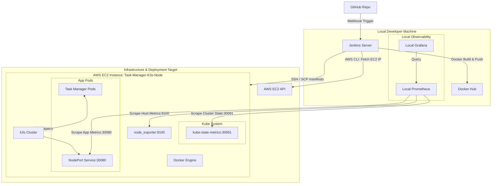

# DevOps Task Manager Deployment Project

**Two-Phase Architecture | Automated Remote Jenkins CI/CD | Local Prometheus & Grafana Monitoring | AWS EC2 k3s Cluster**

---

## 1. Project Overview

This repository contains the complete codebase and automation configurations for the **DevOps Task Manager** application. The project is split to ensure a clean, production-ready DevOps workflow:
- **Phase 1 — One-Time Server Setup:** Terraform provisions an AWS EC2 instance (`t3.micro`) with Docker and an optimized k3s Kubernetes cluster auto-installed via `user_data` (`--disable traefik --disable servicelb`). Lightweight metric exporters (`node_exporter` and `kube-state-metrics`) are deployed to the instance.
- **Phase 2 — Automated CI/CD:** A recurring, automated local Windows Jenkins pipeline builds the container, pushes it to Docker Hub, queries the EC2 IP dynamically using the AWS CLI, copies the manifests via SCP, and deploys updates remotely to the cluster via SSH.
- **Monitoring Architecture:** To run comfortably on a low-resource `t3.micro` instance without OOM faults, the observability engine (Prometheus and Grafana) is deployed **locally** on your developer machine, scraping metrics from the remote EC2 exporters over the network.

For detailed analysis and file specifications, read the full [PROJECT_REPORT.md](PROJECT_REPORT.md).

---

## 2. System Architecture & Workflow



---

## 3. Quickstart Guides

### 3.1 Phase 1 — Server Setup Guide
1. **Provision EC2:** Run Terraform inside `terraform/` to launch the virtual host (`t3.micro` default, Docker & k3s auto-bootstrapped).
   ```bash
   cd terraform
   terraform init
   terraform apply -auto-approve
   ```
2. **Install Lightweight Exporters:** SSH into the EC2 instance and execute:
   - **Node Exporter (Host System Metrics):**
     ```bash
     wget https://github.com/prometheus/node_exporter/releases/download/v1.7.0/node_exporter-1.7.0.linux-amd64.tar.gz
     tar -xvf node_exporter-1.7.0.linux-amd64.tar.gz
     sudo mv node_exporter-1.7.0.linux-amd64/node_exporter /usr/local/bin/

     sudo tee /etc/systemd/system/node_exporter.service <<EOF
     [Unit]
     Description=Node Exporter
     After=network.target

     [Service]
     User=ubuntu
     ExecStart=/usr/local/bin/node_exporter

     [Install]
     WantedBy=multi-user.target
     EOF

     sudo systemctl daemon-reload
     sudo systemctl enable --now node_exporter
     ```
   - **Kube-State-Metrics (Cluster State Metrics):**
     The deployment manifests inside the `k8s/kube-state-metrics.yaml` file are applied automatically as part of the pipeline deployments.

---

### 3.2 Phase 2 — Automated CI/CD Setup Guide
1. Set up a pipeline job in your local Jenkins server.
2. Store Docker Hub credentials as `dockerhub-creds` in Jenkins.
3. Store the EC2 private key in Jenkins credentials as a global SSH Key named `aws-ssh-key`.
4. Run the pipeline. Jenkins will build the image, push it, fetch the EC2 IP, copy the manifests, and apply them.

Alternatively, you can run deployments manually using the provided helper script:
```bash
./deploy.sh <tag>
```

---

### 3.3 Phase 3 — Local Observability Setup Guide
1. Configure your remote EC2 public IP address inside `monitoring/prometheus-local.yml`.
2. Start the local monitoring stack from the `monitoring/` directory:
   ```bash
   docker compose up -d
   ```
3. Access **Prometheus** at `http://localhost:9090` and **Grafana** at `http://localhost:3000` (credentials: `admin` / `admin123`).

---

## 4. Port Mapping & Access URLs

Once all phases are complete, access your services:

| Service | Location | Access URL |
|---------|----------|------------|
| **Task Manager App** | Remote EC2 | `http://<EC2-IP>:30080` |
| **Node Exporter (Raw)** | Remote EC2 | `http://<EC2-IP>:9100/metrics` |
| **Kube-State-Metrics (Raw)** | Remote EC2 | `http://<EC2-IP>:30091/metrics` |
| **Prometheus Console** | Local Host | `http://localhost:9090` |
| **Grafana Dashboard** | Local Host | `http://localhost:3000` |
